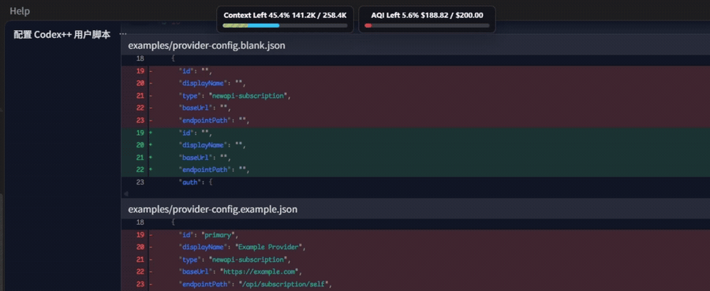

# Codex Context Used Meter

一个给 Codex App / Codex++ 使用的轻量用户脚本，用来在对话界面显示当前会话的上下文余量，并可选显示服务提供商余额。

脚本本身只读取 Codex 渲染页里已经暴露的运行态信号。Provider 余额由本机 helper 读取本地私有配置后获取，再把脱敏 summary 写入页面；真实 token、用户 ID、服务商地址和原始响应不进入渲染页，也不应该提交到仓库。

## 效果展示



## 功能

- 显示 `Context Left xx.x%`，默认表达「还剩多少上下文」。
- 可通过 `ui-config.json` 把 Context 显示切换为 `Context Used xx.x%`。
- Context 条左侧的黄 / 橙斜线表示接近压缩点的区域。
- 可选显示 Provider 余额框，例如订阅额度、已用金额、剩余额度。
- 新消耗 token 或 Provider 余额变化时，从整个组件最左侧中间外侧播放统一的扣血动画。
- token 扣血和 Provider 扣血共用队列，不会同时重叠显示。
- 鼠标悬停在组件附近时显示本次会话的 Context / Provider 消耗历史。
- 右键组件可在 inline / floating 模式之间切换。
- floating 模式支持左右排列和上下排列，并支持拖动位置与滚轮缩放。

## 安装脚本

把 `codex-context-used-meter.js` 复制到 Codex++ 用户脚本目录：

```powershell
New-Item -ItemType Directory -Force "$env:APPDATA\Codex++\user_scripts"
Copy-Item ".\codex-context-used-meter.js" "$env:APPDATA\Codex++\user_scripts\codex-context-used-meter.js" -Force
```

重启 Codex++ / Codex App，或让 Codex++ 重新注入用户脚本。

## UI 交互

默认是 inline 模式：组件会尽量挂到 Codex 顶部工具栏里，位于模型提供商 / 模型选择控件左侧区域。

右键组件打开菜单：

- `Inline mode`：回到工具栏内显示。
- `Floating mode`：改为悬浮显示。
- `Horizontal layout`：floating 模式下左右排列 Context 和 Provider。
- `Vertical layout`：floating 模式下上下排列 Context 和 Provider。

floating 模式下：

- 按住组件短暂停留后拖动，可以移动位置。
- 鼠标滚轮可以缩放组件。
- 模式、布局、位置和缩放保存在浏览器本地 `localStorage`，不写入 JSON 配置文件。

## UI 配置

UI 配置模板在 [config/ui-config.json](config/ui-config.json)。运行时配置建议放在：

```text
%APPDATA%\codex-context-used-meter\ui-config.json
```

首次配置可复制模板：

```powershell
New-Item -ItemType Directory -Force "$env:APPDATA\codex-context-used-meter"
Copy-Item ".\config\ui-config.json" "$env:APPDATA\codex-context-used-meter\ui-config.json" -Force
```

当前可配置项：

```json
{
  "context": {
    "showUsedInsteadOfLeft": false,
    "compressionWarningLeftPercent": 20,
    "levelThresholds": {
      "criticalLeftPercent": 30,
      "dangerLeftPercent": 40,
      "warnLeftPercent": 50,
      "noticeLeftPercent": 60
    }
  },
  "provider": {
    "levelThresholds": {
      "criticalLeftPercent": 30,
      "dangerLeftPercent": 40,
      "warnLeftPercent": 50,
      "noticeLeftPercent": 60
    }
  }
}
```

说明：

- `context.showUsedInsteadOfLeft`：`false` 显示 `Context Left`；`true` 显示 `Context Used`。默认是 `false`。
- `context.compressionWarningLeftPercent`：Context 条最左侧压缩预警斜线区域宽度，默认 20%。
- `context.levelThresholds`：Context 剩余量颜色分档。
- `provider.levelThresholds`：Provider 剩余额度颜色分档。

颜色分档按「剩余百分比」计算。默认含义是：剩余 60% 进入 notice，50% 进入 warn，40% 进入 danger，30% 进入 critical。

## Provider 余额框

Provider 余额框是可选功能。用户脚本不直接请求服务商 API，不读取本机密钥文件。数据流是：

1. `tools/provider-helper.js` 在本机 Node.js 进程里读取私有配置。
2. helper 请求服务商订阅 / 余额接口。
3. helper 把结果规范化为脱敏 summary。
4. helper 通过 Codex++ 打开的 CDP 调试端口把 summary 写入 Codex 页面。
5. 用户脚本只渲染 summary 里的显示名、已用额度、总额度、剩余额度、状态和 UI 配置。

需要的本机配置文件：

```text
%APPDATA%\codex-context-used-meter\provider-config.json
%APPDATA%\codex-context-used-meter\provider-secrets.json
%APPDATA%\codex-context-used-meter\ui-config.json
```

复制模板：

```powershell
New-Item -ItemType Directory -Force "$env:APPDATA\codex-context-used-meter"
Copy-Item ".\config\provider-config.json" "$env:APPDATA\codex-context-used-meter\provider-config.json" -Force
Copy-Item ".\config\provider-secrets.json" "$env:APPDATA\codex-context-used-meter\provider-secrets.json" -Force
Copy-Item ".\config\ui-config.json" "$env:APPDATA\codex-context-used-meter\ui-config.json" -Force
```

`provider-config.json` 只放非密钥配置：

- `codex.debugPort`：Codex++ 打开的 CDP 调试端口。
- `providers[].id`：Provider 本地标识。
- `providers[].displayName`：界面上显示的 Provider 名称。
- `providers[].baseUrl`：Provider API Base URL。
- `providers[].endpointPath`：订阅 / 余额接口路径。
- `providers[].auth.accessTokenSecret`：token 在 `provider-secrets.json` 里的字段名。
- `providers[].userHeader.name`：服务商要求的额外用户 ID header 名；不需要就留空。
- `providers[].userHeader.valueSecret`：用户 ID 在 `provider-secrets.json` 里的字段名；不需要就留空。
- `providers[].refreshIntervalMs`：刷新周期，默认 10 秒。
- `providers[].quota.amountDivisor`：Provider 原始额度与显示金额之间的换算因子。

`provider-secrets.json` 只放本机私密值。字段名要和 `provider-config.json` 里的 `accessTokenSecret` / `valueSecret` 对上。

不要把真实 token、用户 ID、服务商地址、完整私有配置或原始响应贴到 issue、聊天、日志或提交里。

## 启动 Provider helper

安装跟随 Codex 自动启停的 supervisor：

```powershell
.\tools\install-provider-supervisor.ps1
```

它会给当前 Windows 用户创建计划任务。登录后 supervisor 会常驻一个轻量进程：Codex 打开时启动 `provider-helper.js`，Codex 关闭后停止 helper。

只运行一次 helper 做验证：

```powershell
node .\tools\provider-helper.js --once
```

只测试 Provider 请求和响应解析，不注入 Codex 页面：

```powershell
node .\tools\provider-helper.js --once --no-cdp --print-summary
```

如果验证输出可能包含敏感字段，只保留 HTTP 状态、provider 是否 active、字段是否存在这类摘要，不要回显完整响应。

卸载 supervisor：

```powershell
.\tools\uninstall-provider-supervisor.ps1
```

## 排障

Context 不显示：

- 确认当前窗口是 Codex 对话页，不是头像、宠物或其它 overlay 页面。
- 确认 Codex 页面已经暴露 context usage 信号；新会话刚打开时可能需要等待一次刷新。
- 重新注入脚本或重启 Codex++。

Provider 不显示：

- 确认 `provider-helper.js` 或 supervisor 正在运行。
- 确认 `provider-config.json` 和 `provider-secrets.json` 在 `%APPDATA%\codex-context-used-meter`。
- 确认 `codex.debugPort` 与 Codex++ 实际 CDP 端口一致。
- 用 `node .\tools\provider-helper.js --once --no-cdp --print-summary` 验证 Provider 解析。

扣血动画重叠：

- 当前版本的 token 和 Provider 扣血已经走统一队列，正常情况下不会重叠。
- 如果页面里还在运行旧注入脚本，重启 Codex++ 或重新注入用户脚本。

## 让 Agent 自动安装

可以把下面这段复制给本机 Agent：

```text
请帮我安装 Codex Context Used Meter：

1. 使用这个仓库：https://github.com/Minghou-Lei/codex-context-used-meter
2. 把 codex-context-used-meter.js 复制到 %APPDATA%\Codex++\user_scripts\codex-context-used-meter.js。
3. 不要修改 Codex 全局配置，不要写入任何服务商密钥。
4. 安装后确认目标文件存在，并检查脚本里的 SCRIPT_VERSION。
5. 如果我要配置 Provider 余额框，请先读取仓库里的 config/README.md。
```

## 让 Agent 自动配置 Provider

Provider 配置和脚本安装是两件事。可以把下面这段单独复制给本机 Agent：

```text
请帮我给 Codex Context Used Meter 配置 Provider 余额框：

1. 使用仓库：https://github.com/Minghou-Lei/codex-context-used-meter
2. 先读取 config/README.md。
3. 先说明需要我提供哪些值：Provider 显示名、API Base URL、订阅 / 余额接口路径、访问 token、是否需要额外用户 ID header、header 名、用户 ID 值。
4. 不要在聊天里回显 token、用户 ID、真实服务商地址、完整配置文件或原始响应。
5. 如果 %APPDATA%\codex-context-used-meter\provider-config.json 不存在，就从 config\provider-config.json 复制模板。
6. 如果 %APPDATA%\codex-context-used-meter\provider-secrets.json 不存在，就从 config\provider-secrets.json 复制模板。
7. 如果 %APPDATA%\codex-context-used-meter\ui-config.json 不存在，就从 config\ui-config.json 复制模板。
8. 只把非密钥配置写入 provider-config.json。
9. 只把真实 token 和真实用户 ID 写入 provider-secrets.json。
10. 安装 tools\install-provider-supervisor.ps1。
11. 用 node .\tools\provider-helper.js --once --no-cdp --print-summary 做一次验证；输出只保留脱敏摘要。
```

## 安全边界

- 不提交 `%APPDATA%\codex-context-used-meter` 下的本机私有配置。
- 不提交真实 token、用户 ID、服务商 API 地址或原始响应。
- 不把 `provider-secrets.json` 贴到 issue、聊天或日志。
- 仓库内 `config/*.json` 只作为模板，保持为空值或占位值。

## License

MIT

---

# Codex Context Used Meter

A lightweight Codex App / Codex++ user script that shows the current conversation's context budget and can optionally show a provider balance card.

The user script only reads runtime signals already exposed in the Codex renderer page. Provider balance data is fetched by a local helper from private local config, normalized into a sanitized summary, and then pushed into the page. Real tokens, user IDs, provider endpoints, and raw provider responses must stay out of the renderer page and out of the repository.

## Demo


## Features

- Shows `Context Left xx.x%` by default.
- Can show `Context Used xx.x%` instead via `ui-config.json`.
- Shows a striped warning zone on the left side of the Context bar when the conversation is close to compaction.
- Optionally shows a Provider balance card with used, total, remaining, and status data.
- Plays spend pop text from the whole component's left-middle outside edge.
- Context token spend and Provider spend share one queue, so the pop text does not overlap.
- Shows per-session Context / Provider spend history while hovering near the component.
- Right-click menu switches between inline and floating modes.
- Floating mode supports horizontal / vertical layout, drag position, and wheel zoom.

## Install Script

Copy `codex-context-used-meter.js` into the Codex++ user scripts directory:

```powershell
New-Item -ItemType Directory -Force "$env:APPDATA\Codex++\user_scripts"
Copy-Item ".\codex-context-used-meter.js" "$env:APPDATA\Codex++\user_scripts\codex-context-used-meter.js" -Force
```

Restart Codex++ / Codex App, or reload user scripts from Codex++.

## UI Interaction

Inline mode is the default. The component tries to mount into the Codex top toolbar, in the area to the left of the provider / model selector controls.

Right-click the component to open the menu:

- `Inline mode`: mount inside the toolbar.
- `Floating mode`: show as a floating overlay.
- `Horizontal layout`: arrange Context and Provider side by side in floating mode.
- `Vertical layout`: stack Context and Provider in floating mode.

In floating mode:

- Hold the component briefly, then drag to move it.
- Use the mouse wheel over the component to zoom it.
- Mode, layout, position, and scale are stored in browser `localStorage`; they are not written to JSON config files.

## UI Config

The UI config template is [config/ui-config.json](config/ui-config.json). Runtime config should usually live at:

```text
%APPDATA%\codex-context-used-meter\ui-config.json
```

Copy the template:

```powershell
New-Item -ItemType Directory -Force "$env:APPDATA\codex-context-used-meter"
Copy-Item ".\config\ui-config.json" "$env:APPDATA\codex-context-used-meter\ui-config.json" -Force
```

Available settings:

```json
{
  "context": {
    "showUsedInsteadOfLeft": false,
    "compressionWarningLeftPercent": 20,
    "levelThresholds": {
      "criticalLeftPercent": 30,
      "dangerLeftPercent": 40,
      "warnLeftPercent": 50,
      "noticeLeftPercent": 60
    }
  },
  "provider": {
    "levelThresholds": {
      "criticalLeftPercent": 30,
      "dangerLeftPercent": 40,
      "warnLeftPercent": 50,
      "noticeLeftPercent": 60
    }
  }
}
```

Notes:

- `context.showUsedInsteadOfLeft`: `false` shows `Context Left`; `true` shows `Context Used`. Default: `false`.
- `context.compressionWarningLeftPercent`: width of the left-side compaction warning zone. Default: 20%.
- `context.levelThresholds`: Context color thresholds.
- `provider.levelThresholds`: Provider balance color thresholds.

Thresholds are based on remaining percentage. By default, 60% remaining enters notice, 50% enters warn, 40% enters danger, and 30% enters critical.

## Provider Balance Card

The Provider balance card is optional. The user script does not call provider APIs and does not read local secret files. Data flow:

1. `tools/provider-helper.js` reads private local config in a local Node.js process.
2. The helper calls the provider subscription / balance endpoint.
3. The helper normalizes the result into a sanitized summary.
4. The helper writes that summary into the Codex page through the CDP debug port opened by Codex++.
5. The user script only renders display name, used amount, total amount, remaining amount, status, and UI config from the summary.

Local runtime config files:

```text
%APPDATA%\codex-context-used-meter\provider-config.json
%APPDATA%\codex-context-used-meter\provider-secrets.json
%APPDATA%\codex-context-used-meter\ui-config.json
```

Copy templates:

```powershell
New-Item -ItemType Directory -Force "$env:APPDATA\codex-context-used-meter"
Copy-Item ".\config\provider-config.json" "$env:APPDATA\codex-context-used-meter\provider-config.json" -Force
Copy-Item ".\config\provider-secrets.json" "$env:APPDATA\codex-context-used-meter\provider-secrets.json" -Force
Copy-Item ".\config\ui-config.json" "$env:APPDATA\codex-context-used-meter\ui-config.json" -Force
```

`provider-config.json` stores non-secret settings only:

- `codex.debugPort`: CDP debug port opened by Codex++.
- `providers[].id`: local provider identifier.
- `providers[].displayName`: provider name shown in the UI.
- `providers[].baseUrl`: provider API base URL.
- `providers[].endpointPath`: subscription / balance endpoint path.
- `providers[].auth.accessTokenSecret`: key name for the token in `provider-secrets.json`.
- `providers[].userHeader.name`: optional extra user ID header name.
- `providers[].userHeader.valueSecret`: key name for the user ID in `provider-secrets.json`.
- `providers[].refreshIntervalMs`: refresh interval. Default: 10 seconds.
- `providers[].quota.amountDivisor`: conversion factor between provider raw quota and displayed amount.

`provider-secrets.json` stores local private values only. Its keys must match `accessTokenSecret` / `valueSecret` in `provider-config.json`.

Do not paste real tokens, user IDs, provider endpoints, full private config, or raw provider responses into issues, chat, logs, or commits.

## Start Provider Helper

Install the supervisor that starts and stops with Codex:

```powershell
.\tools\install-provider-supervisor.ps1
```

It creates a scheduled task for the current Windows user. After login, the supervisor keeps a lightweight process alive: when Codex is open, it starts `provider-helper.js`; when Codex closes, it stops the helper.

Run the helper once:

```powershell
node .\tools\provider-helper.js --once
```

Test provider fetch and response parsing without injecting into Codex:

```powershell
node .\tools\provider-helper.js --once --no-cdp --print-summary
```

If verification output may contain sensitive fields, keep only a sanitized summary such as HTTP status, whether a provider is active, and whether required fields exist.

Uninstall the supervisor:

```powershell
.\tools\uninstall-provider-supervisor.ps1
```

## Troubleshooting

Context card is missing:

- Make sure the current window is a Codex conversation page, not an avatar, pet, or other overlay page.
- Make sure the Codex page has exposed context usage signals; a newly opened conversation may need one refresh cycle.
- Reload the user script or restart Codex++.

Provider card is missing:

- Make sure `provider-helper.js` or the supervisor is running.
- Make sure `provider-config.json` and `provider-secrets.json` exist under `%APPDATA%\codex-context-used-meter`.
- Make sure `codex.debugPort` matches the actual Codex++ CDP port.
- Run `node .\tools\provider-helper.js --once --no-cdp --print-summary` to validate provider parsing.

Spend pop text overlaps:

- Current versions queue Context and Provider spend effects, so they should not overlap.
- If an old injected script is still running in the page, restart Codex++ or reload the user script.

## Agent Install Prompt

You can copy this prompt into a local agent:

```text
Please install Codex Context Used Meter:

1. Use this repository: https://github.com/Minghou-Lei/codex-context-used-meter
2. Copy codex-context-used-meter.js to %APPDATA%\Codex++\user_scripts\codex-context-used-meter.js.
3. Do not modify global Codex config and do not write provider secrets.
4. After installation, verify the target file exists and check SCRIPT_VERSION.
5. If I also want the Provider balance card configured, read config/README.md first.
```

## Provider Setup Prompt

Provider setup is separate from script installation. You can copy this prompt into a local agent:

```text
Please configure the Provider balance card for Codex Context Used Meter:

1. Use this repository: https://github.com/Minghou-Lei/codex-context-used-meter
2. Read config/README.md first.
3. First tell me which values I need to provide: provider display name, API base URL, subscription / balance endpoint path, access token, whether an extra user ID header is required, header name, and user ID value.
4. Do not echo tokens, user IDs, real provider endpoints, full config files, or raw responses back into chat.
5. If %APPDATA%\codex-context-used-meter\provider-config.json does not exist, copy the template from config\provider-config.json.
6. If %APPDATA%\codex-context-used-meter\provider-secrets.json does not exist, copy the template from config\provider-secrets.json.
7. If %APPDATA%\codex-context-used-meter\ui-config.json does not exist, copy the template from config\ui-config.json.
8. Only write non-secret settings to provider-config.json.
9. Only write the real token and real user ID to provider-secrets.json.
10. Install tools\install-provider-supervisor.ps1.
11. Run node .\tools\provider-helper.js --once --no-cdp --print-summary once; only show a sanitized summary.
```

## Security Boundary

- Do not commit local private config under `%APPDATA%\codex-context-used-meter`.
- Do not commit real tokens, user IDs, provider API endpoints, or raw provider responses.
- Do not paste `provider-secrets.json` into issues, chat, or logs.
- Repository `config/*.json` files are templates only and should keep empty or placeholder values.

## License

MIT
